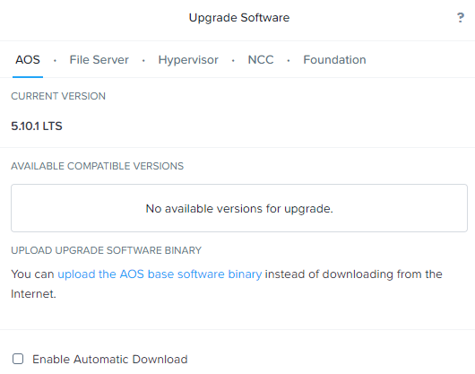

.. _aos_upgrade:

-----------
AOS Upgrade
-----------

.. note::

   - Before performing the procedure below, make sure you are running the latest version of the Nutanix Cluster Check (NCC) health checks and upgrade NCC if necessary.  Run all NCC checks, and check the Health Dashboard. If any health checks are failing, resolve them to ensure that the cluster is healthy before continuing.
   - If you use Prism Central to manage your Nutanix clusters, upgrade Prism Central first, then upgrade AOS on the clusters managed by Prism Central.

Guidelines and Requirements
+++++++++++++++++++++++++++

Each node in a cluster runs AOS. When commencing an upgrade, every node will be upgraded to that version. Nutanix provides a live upgrade mechanism that allows the cluster to run continuously while a rolling upgrade of the nodes is started in the background.

AOS supports upgrades that you can apply through the Prism web console Upgrade Software feature (also known as 1-click upgrade).

You can view the available upgrade options, start an upgrade, and monitor upgrade progress through the web console.

Procedure
+++++++++

#. Log on to the web console for any node in the cluster.

#. Click the :fa:`gear` **> Settings > Upgrade Software > AOS**, or from the dropdown menu choose **Settings > Upgrade Software > AOS** to display the current status of your software versions (and start an upgrade if available and desired).

   - *CURRENT VERSION* displays the version running currently in the cluster.
   - *AVAILABLE COMPATIBLE VERSIONS* displays any versions to which the cluster can be updated.
   - The upload the AOS base software binary link enables you to install from binary and metadata files, which might be helpful for updating isolated (dark-site) clusters not connected to the Internet.

#. [Optional] To run the pre-upgrade installation checks only on the Controller VM where you are logged on without upgrading, click **Upgrade > Pre-upgrade**. These checks also run as part of the upgrade procedure.

#. Before executing upgrade, recommend one of the following to illustrate that workloads continue to run without interruption while the AOS upgrade proceeds
   - Option 1. BASIC: Live pings between VMs during upgrade **Link to Basic VM management steps to deploy/clone VMs**
      - Steps to setup ping between 2 VMs
   - Option 2. ADVANCED: Use X-ray to run OLTP/VDI workload **Link to X-ray deployment**
      - X-ray can be run on the cluster for this purpose
      - When using, select the "Primary" VLAN for worker VMs
      - Can we cancel/stop a running X-Ray workload? If so, flat recommend running workload for 4 hours and then cancel after upgrade.
      - Recommendations on hardware to ensure successful demonstration?

#. Do one of the following:
   - If you previously selected Enable Automatic Download and the desired software package has been downloaded, click **Upgrade > Upgrade Now**, then click **Yes** to confirm.
   - If Enable Automatic Download is cleared, click **Download** next to the desired software package. When the download task is completed, click **Upgrade > Upgrade Now**, then click **Yes** to confirm.

      .. figure:: images/2.png
         :align: left
         :scale: 60%
      .. figure:: images/3.png
         :align: center
         :scale: 60%
      .. figure:: images/4.png
         :align: right
         :scale: 60%

   - Upgrading AOS by uploading binary and metadata files
      - Log on to the Nutanix Support Portal, and select the AOS release from the `Downloads <https://portal.nutanix.com/#/page/releases/nosDetails/>`_ page.
      - Download the AOS binary and metadata .JSON files on your local media. You can also copy these files to a USB stick, CD, or other media.
      - Click the *upload an AOS binary* link. Click **Choose File** for the AOS metadata and binary files, respectively, browse to the file locations, and click **Upload Now**.  Once the software package has been uploaded, click **Upgrade > Upgrade Now**, then click **Yes** to confirm.

      .. figure:: images/6.png
         :align: left
         :scale: 60%
      .. figure:: images/7.png
         :align: center
         :scale: 60%
      .. figure:: images/5.png
         :align: right
         :scale: 60%

   The Upgrade Software dialog box shows the progress of your selection, including pre-installation and cluster health checks. After the upgrade process is completed on a Controller VM, the Controller VM restarts. This restart is not disruptive to node operations.

What to do next

   After upgrading AOS and before upgrading your hypervisor on each cluster, perform a Life Cycle Manager (LCM) inventory, update LCM, and upgrade any recommended firmware.  **LINK TO LCM SECTION**
