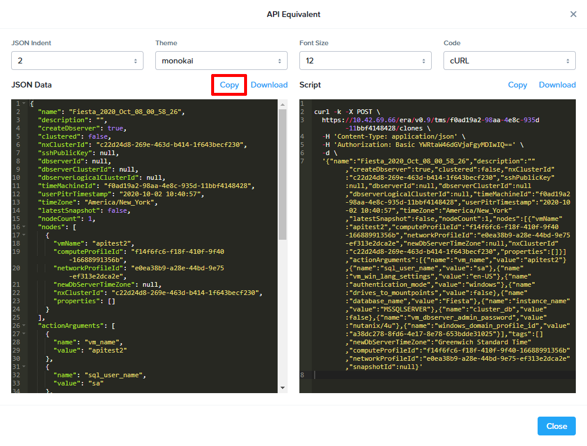

.. _basic_clone_api:

Please complete :ref:`era_mssql` before proceeding.

----------------------------
Time Machine & Cloning - API
----------------------------

Era provides the *Time Machine* functionality to simplify cloning operations. Time Machine captures and maintains snapshots and transactional logs of your source databases as defined in the schedule. For every source database you register with Era, a Time Machine is created for that source database. You'd then create clones that are not only space efficient, but enable you to refresh clones either to a point in time (by using transactional logs) or by using snapshots. These operations eliminate what was a previously manual process, thus allowing the DBA to focus their efforts on more pressing endeavors.

Copy Data Management (CDM) (a.k.a. database cloning) is a critical day 2 database operation. Multiple teams, such as developers, QA, and analysts often request separate copies of production databases for their own purposes. Each additional clone comes with a cost: an ever-increasing strain on the company's storage capacity. Two clones? Double the storage, and so forth. An additional challenge is providing these teams with the most up-to-date production data from which to test. All too often this is a manual task, requiring the full attention of a database administrator (DBA).

In this lab you will API calls to:

- Create a clone of your SQL Server production database *FiestaDB_Prod*, and along with its dedicated web server, will be used as a development environment.
- Make changes to your production database, and refresh your development environment.
- Use your *FiestaDB_Dev* environment to observe the modifications made to the production database are reflected in the development environment.

.. note::

   Before proceeding with the below, please be aware that the same steps will be accomplished also using the :ref:`basic_clone_ui` section.

Cloning from the Era API
++++++++++++++++++++++++

In this exercise you will explore the workflow for cloning a database through the Era APIs. At the end of this exercise you will not click **Clone** to begin the cloning process, you will instead create the clone programmatically in the next exercise. This exercise will utilize the UI to capture the information we need.

#. In **Era**, select **Time Machines** from the dropdown menu.

#. Select the Time Machine associated with your production database (e.g. *fiesta_TM*).

#. Select **Actions > Create Database Clone > Database**.

By default, a clone will be created from the most recent *Point in Time*. While not utilized in this workshop, you can specify a previous point in time or snapshot.

#. Click **Next**.

   .. figure:: images/1.png

   Databases can be cloned alongside an entirely new server, automatically provisioned by Era, or as an additional database inside an existing database server.

#. Make the following selections and click **Next**:

   Be sure to use this exact naming shown, as changing this will prevent you from successfully completing the proceeding steps.

   - **Database Server VM** - Create New Server
   - **Database Server Name** - FiestaDB_Dev
   - **Compute Profile** - DEFAULT_OOB_COMPUTE
   - **Network Profile** - DEFAULT_OOB_SQLSERVER_NETWORK
   - **Administrator Password** - nutanix/4u
   - Select **Join Domain**
   - **Windows Domain Profile** - NTNXLAB

   .. figure:: images/2.png

#. Select **API Equivalent**.

#. Review the **JSON Data** and example **Script** presented by the Era UI for programmatically generating a database clone based on your inputs. Click **Copy** within the *JSON* section (left-hand side).

.. note::

   If you care to paste this into another program, be sure that program retains the formatting, as some (ex. built-in Windows Notepad) will not. Recommend Notepad++ or Sublime Text.

#. Click **Close** and then click **X** to close the *Clone Database* wizard.

#. From the *admin* dropdown, choose **REST API Explorer**. A new browser tab will open. You will use this throughout this section.

   .. figure:: images/4.png

#. Expand the **Time Machines** section, and then the **POST ​/tms​/{timemachine_id}​/clones Create Clone using given Time Machine** section.

   .. figure:: images/5.png

#. Click **Try it out**, and then paste the **JSON Data** previously copied.

   .. figure:: images/6.png

#. Within the *timemachine_id* field, enter the **timemachine_id** value from within the data you pasted.

   .. figure:: images/7.png

#. Click **Execute**.

#. Scroll down to observe the responses to your API calls.

#. In Era, select **Operations** from the dropdown to monitor the progress. This should take approximately 15 minutes.

Deploy Development Web Server
+++++++++++++++++++++++++++++

This exercise will walk you through creating a web server configured for your *FiestaWEB_Dev* MSSQL server.

#. In **Prism Central**, select :fa:`bars` **Virtual Infrastructure > VMs**.

#. Click **Create VM** and fill out the following fields:

   - **Name** - FiestaWEB_Dev
   - **vCPUs** - 2
   - **Number of Cores Per vCPU** - 1
   - **Memory** - 4 GiB
   - Click :fa:`plus`**Add New Disk**

      - **Type** - Disk
      - **Operation** - Clone from Image Service
      - **Bus Type** - SCSI
      - **Image** - CentOS_7_cloud.qcow2
      - Click **Add**

   - Click :fa:`plus`**Add New NIC**

      - **Network Name** - Primary
      - Click **Add**

   - Select **Custom Script**
   - Select **Type or Paste Script**. Click the icon in the upper right-hand corner of the below window to copy the script to your clipboard. You may then paste the following *cloud-config* script:

      .. literalinclude:: webserver.cloudconfig
       :linenos:
       :language: YAML

   .. warning::

      Before proceeding, modify the **YOUR-FIESTADB_DEV-VM-IP-ADDRESS** portion within line 105 in the cloud-config script with the IP address from your *FiestaDB_Dev* VM. No other modifications are necessary.

      Example: `- sed -i 's/REPLACE_DB_HOST_ADDRESS/10.42.69.85/g' /home/centos/Fiesta/config/config.js`

#. Once the VM has completed deploying, open `http://<FIESTAWEB_DEV-IP-ADDRESS>:5001` in a new browser tab to access the *Development* Fiesta application.

Refreshing Cloned Databases
+++++++++++++++++++++++++++

Now that you have a functioning development environment, it's time to create some changes within your production environment.

#. In a new browser tab, return to your *Production* Fiesta web app (i.e. *FiestaWEB_Prod* web server). Click **Products > Add New Product**.

   .. figure:: images/16.png

#. Fill out the following fields and click **Submit**:

   - **Product Name** - The Best Balloons
   - **Suggested Retail Price** - 100.00
   - **Product Image URL** - `https://partycity6.scene7.com/is/image/PartyCity/_pdp_sq_?$_1000x1000_$&$product=PartyCity/251182`
   - **Product Comments** - Everybody Knows

   .. figure:: images/17.png

#. Click **Stores** from the menu, and select **View Store** from one of the available stores.

#. Click **Add New Store Product**. Fill out the following fields and click **Submit**:

   - **Product Name** - The Best Balloons
   - **Local Product Price** - 99.99
   - **Initial Qty** - 1000

#. Verify the inventory for the added product appears on the **Store Details** page.

   .. figure:: images/18.png

#. In a separate browser tab, open your **Dev** Fiesta web app (i.e. *FiestaWEB_Dev*). Observe that the products and inventory added to the *Production* instance are NOT present.

#. In Era, choose **Time Machines** from the dropdown. Select the *Time Machine* that corresponds to your production database (i.e. *FiestaDB_Prod*). Select **Actions > Log Catch Up > API Equivalent**.

#. Review the **JSON Data** and example **Script** presented by the Era UI for programmatically generating a database clone based on your inputs.

#. Click **Copy** within the *Script* section (right-hand side) to capture the *Time Machice ID* (ex. `18c121fd-db4c-4436-8113-da5c70424475`).

   .. figure:: images/19a.png

#. Return to the *API Explorer* browser tab.

#. Click on **POST ​/tms​/{timemachine_id}​/log-catchups Start Log Catchup for given time machine**.

   .. figure:: images/19.png

#. Click **Try it out**, and then paste the *Time Machine ID* previously copied, into the *timemachine_id* box.

   .. figure:: images/19b.png

#. Within Era, click **Copy** within the *JSON* section (left-hand side).

#. Return to the *API Explorer* browser tab.

#. Paste in the *JSON* data you copied into the **BODY** section.

#. Click **Execute** to ensure the latest database entries have been flushed to disk.

#. Scroll down to observe the responses to your API calls.

#. In Era, select **Operations** from the dropdown to monitor the progress. This should take approximately 1 minute.

#. Choose **Databases** from the dropdown, then **Clones** from the left-hand side. Select your cloned database and click **Refresh**.

#. By default, the database will be refreshed to the most recent *Point in Time*, but you can manually specify a time or individual snapshot. For the purposes of this exercise, leave the default and click **API Equivalent**.

   .. figure:: images/21a.png

#. Click **Copy** within the *JSON* section (left-hand side).

#. Return to the *API Explorer* browser tab.

#. Click on **POST ​/clones​/{clone_id}​/refresh Start Refresh Operation for given Clone**.

   .. figure:: images/22.png

#. Monitor the refresh on the *Operations* page. This should take approximately 5 minutes.

#. Once the refresh has completed, open your *Development* Fiesta web app (i.e. *FiestaWEB_Dev*) and validate the product and inventory mofifications are now present, as they were in your *Production* database.

   .. figure:: images/18.png

With a few mouse clicks, your DBA was able to push current production data to the cloned database utilized for development work within minutes.

Takeaways
+++++++++

What are the key things we learned in this lab?

- Era makes it simple to create space efficient, zero-byte database clones to any point-in-time.
- Era provides production-like quality of service (QoS) for clones, with fast creation and data refresh.
- Era operations can be performed through REST API, making it easy to integration with Nutanix Calm or third-party automation solutions
