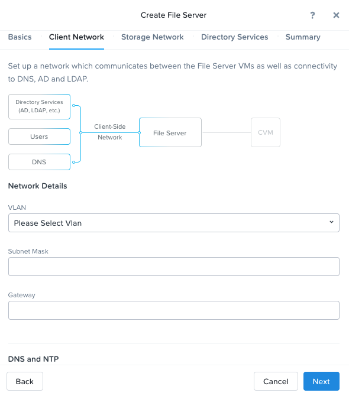

.. _files:

-----
Files
-----

Prerequisites and Requirements
++++++++++++++++++++++++++++++

Review `NUTANIX FILES GUIDE <https://portal.nutanix.com/page/documents/details/?targetId=Files-v35:Files-v35>`_ and `FILE ANALYTICS GUIDE <https://portal.nutanix.com/page/documents/details/?targetId=File-Analytics-v2_1%3AFile-Analytics-v2_1>`_ for all details including, but not limited to, prerequities, requirements, and recommendations before proceeding.

.. note::

   To reduce time required to provision a Microsoft Active Directory (AD) server, it is recommended to use the AutoAD VM. It can be selected as an image to deploy when reserving an HPOC, or manually downloaded and deployed.

.. note::

   There are many options at various stages that are available to configure Files to suit needs of our customers. This workshop will focus on the following. Refer to the *NUTANIX FILES GUIDE* linked above for additional configuration options.

      - One File Server    - basic configuration, 3 File Server VMs (FSVM)
      - One file share     - SMB
      - One hypervisor     - AHV
      - AD authentication  - AutoAD VM
      - One VLAN
      - Files Analytics

Creating a File Server
++++++++++++++++++++++

#. In the Prism web console, go to the *File Server Dashboard* page by clicking **File Server** from the dropdown.

#. Click **+ File Server**.

   .. figure:: images/1.png

#. In the *New File Server: Pre-Check* window, review the displayed information and address any unsatisfied prerequisites before continuing.

   .. figure:: images/1a.png

#. The *Create File Server* window appears and displays the *Basics* tab. Do the following in the indicated fields:

   .. figure:: images/2.png

   - **Name**: Enter a name for the file server.
      The file server name is used by clients to access the file server. The fully qualified name (file server name + domain) must be unique.

   - **Domain**: **ntnxlab.local**

   - **File Server Storage**: Enter the file server total storage size (minimum 1 TiB).

      - Click the **Next** button.

   .. note::

      When utilizing the HPOC, it is recommended to use .8 to .14 for the last octet for the 7 IP addresses required by the File Server VMs (FSVM) in the proceeding steps.

#. In the *Client Network* tab, do the following in the indicated fields:

      .. figure:: images/5.png

   - VLAN: Select the target VLAN for the client network from the pull-down list.
      Once the target is selected, previously configured network parameters are displayed if the target VLAN is a managed network.

      .. figure:: images/managed.png
          :align: left
          :scale: 50%

         Managed VLAN

      .. figure:: images/unmanaged.png
          :align: right
          :scale: 50%

         Unmanaged VLAN

   - When all the entries are correct, click the **Next** button.

#. In the *Storage Network* tab, do the following in the indicated fields:

   - VLAN: Select the target VLAN  for the storage network from the pull-down list.
      As with the client network, configured network parameters are displayed once the target is selected if the target is a managed network.

   - When all the entries are entered, click the **Next** button.

#. In the *Directory Services* tab, check the **Use SMB Protocol** box.

   .. note::

      You have the option to skip this step and select the protocol(s) at a later time, but you cannot use the file server until this step is complete.

      .. figure:: images/7.png

#. If you selected the SMB protocol, fill out the following in the indicated fields:

   - **Active Directory Realm Name**: Displays the Active Directory realm name (read-only).

   - **Username**: Enter the name of an Active Directory user with administrator privileges. Use the following format: *domain\username*.

   - **Password**: Enter the user's password.

   - **Make this user a File Server admin**: Check this box.

#. In the Summary tab, review the displayed information. When all the information is correct, click **Create**.

Creating the file server begins. You can monitor progress through the **Tasks** page.

.. warning::

   If you accidentally did not configure Files to use the AutoAD as the DNS server, after deploying the File Server you will get the following errors.

      - DNS 'NS' records not found for *domain*

      - Failed to lookup IP address of *domain*. Please verify the domain name, DNS configuration and network connectivity.

   This can easily be corrected after deployment, without having to delete and redeploy the Files Server.

      - Within the **File Server** dropdown, select the file server you deployed, and click **Update > Network Configuration**. Modify the entry for *DNS Resolver IP*, and click **Next > Save**.

      - Click **DNS**. Update this page with the AutoAD FQDN - **dc.ntnxlab.local**, Username and Password of an Active Directory user with administrator privileges. Click **Submit**.

      .. figure:: images/10.png

Creating a File Share
+++++++++++++++++++++

This task details how to create new shares using the Nutanix file server.

#. Click **File Server** from the dropdown.

#. Click **+ Share** in the right corner.

#. Complete the fields to create the file share. Click **Save**.

   - **NAME**: Enter the name for the share.
   - **FILE SERVER**: From the drop-down list, select the file server to place the share.

#. Click **Next > Next > Create**.

   .. figure:: images/smb-share.png

What to do next
+++++++++++++++

Map the newly created share in your directory. In the Windows client, you can map to the network and create folders at the top level of the file share.

#. In the Windows client VM, open *File Explorer*. Right click on **This PC** and select **Map Network Drives**.

#. Select the drive letter to use for the share. Enter the path to the share in the `\\`*FileServerFQDN*`\`*share* format. Click **Finish**.
   A new window will open displaying the contents of the share. Create files and folders as you see fit.

---------------
Files Analytics
---------------

#. Go to **Support Portal > Downloads > Files** and download the File Analytics QCOW2 and JSON files.

#. In Prism, go to the *File Server* view and click the **Deploy File Analytics** action link.

#. In the *Deploy File Analytics* window, click **Deploy**.

#. Upload installation files.
   - In the *Upload installation binary* section, click on the **upload the File Analytics binary** link to upload the File Analytics JSON and QCOW files.
   - Under *File Analytics Metadata File (.Json)*, click **Choose File** to choose the downloaded JSON file.
   - Under *File Analytics Instalation Binary (.Qcow2)*, click **Choose File** to choose the downloaded QCOW file.
   - Click **Upload Now** after choosing the files.

#. Do the following in the indicated fields:

   - **Name**: Enter a name for the File Analytics VM (AVM).
   - **Storage Container**: select a storage container from the dropdown. The dropdown only displays file server storage containers.
   - **Network List**: Select a VLAN.

#. (optional) Check the **Show Advanced Settings** box and do the following in the indicated fields.

   - Memory (GiB): Enter the memory capacity for the Analytics VM.
   - VCPUs: Enter the number of vCPUs.
   - Cores: Enter the number of cores.
   - DNS Resolver IP: Enter a coma-separated list of DNS resolver IPs.
   - NTP Servers: Enter a comma-separated list of NTP servers.

#. Click **Deploy**.

Enabling Files Analytics
++++++++++++++++++++++++

#. Within the *File Server* view in Prism, select the target file server.

#. Click **Manage roles** to add a file server admin user.

#. In the *File Server* view, select the target file server and click **File Analytics** in the tabs bar.

#. In the *Data Retention* field, select a data retention period.

#. In the *Enable File Analytics* dialog-box, enter the credentials as indicated:

   - **For SMB users only** In the SMB Authentication section, do the following in the indicated fields to provide SMB authentication details:
      - Username: Enter the AD username for the file server administrator, see File Analytics Prerequisites.
      - Password: Enter the AD user password for the file server administrator.
   - **For NFS users only** In the NFS Authentication section, do the following in the indicated fields to provide NFS authentication details:
      - LDAP Server URI: Enter the URI of the LDAP server.
      - Base DN: Enter the base DN for the LDAP server.
      - Password: Enter the LDAP user password for the file server administrator.

Testing with client PC
++++++++++++++++++++++

If you are using *AutoAD* for your Windows Active Directory Domain Controller, it is pre-populated with the following Users and Groups for your use:

   .. list-table::
      :widths: 25 35 40
      :header-rows: 1

      * - Group
        - Username(s)
        - Password
      * - Administrators
        - Administrator
        - nutanix/4u
      * - SSP Admins
        - adminuser01-adminuser25
        - nutanix/4u
      * - SSP Developers
        - devuser01-devuser25
        - nutanix/4u
      * - SSP Consumers
        - consumer01-consumer25
        - nutanix/4u
      * - SSP Operators
        - operator01-operator25
        - nutanix/4u
      * - SSP Custom
        - custom01-custom25
        - nutanix/4u
      * - Bootcamp Users
        - user01-user25
        - nutanix/4u

Deploy new Windows 10 VM
[Optional] If you are not using a network with IPAM/DNS/domain/etc. configured, set static IP, and configure DNS to point to AutoAD
Change the computer Name
Join Domain
Login to domain as test user
