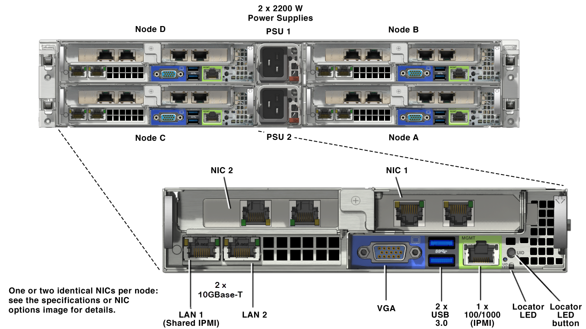

.. _foundation:

-------------------
Physical Foundation
-------------------

If doing an on-premises POC, you will need to perform a fresh Foundation on your hardware. Many SEs opt to test Foundation on the cluster at home to identify any potential issues (bad SATADOM, loose memory, etc.) before bringing the block to a customer site. It is also possible, depending on the state of the Nutanix nodes you receive, that you may need to perform a Bare Metal Foundation of the nodes in order to create a Nutanix Cluster (i.e. unknown passwords for IPMI, cluster was not destroyed prior, etc.).  The SE would then typically run Foundation again on-site as the installation process is often a part of POC test plans, allowing us to demonstrate how fast and simple it is to deploy Nutanix.

**Expected Module Duration:** 150 minutes (Including racking, cabling, Foundation, and transition to customer network)

**Covered Test IDs:** `Core-001, Core-002 <https://confluence.eng.nutanix.com:8443/display/SEW/Official+Nutanix+POC+Guide+-+INTERNAL>`_

Setting Up Your Foundation Environment
++++++++++++++++++++++++++++++++++++++

.. note::

   These documents contained here are the latest as of the writing of this guide. Always refer to the latest version of the Foundation documentation on the `Nutanix Portal - Foundation Documentation <https://portal.nutanix.com/page/documents/list?type=software&filterKey=software&filterVal=Foundation>`_.

Currently, there are two options for performing baremetal Foundation of a Nutanix block, Portable Foundation and the Foundation VM. `Field Installation Guide - Foundation Use Case Matrix section <https://portal.nutanix.com/page/documents/details/?targetId=Field-Installation-Guide-v4-5%3Av45-features-compatibility-matrix-r.html>`_.

(Recommended) Foundation App/Portable Foundation
.................................

- Foundation App is a native application that runs on Windows 10+ or macOS 10.13.1+
- Only supports Nutanix G4 and above, Dell, HPE, and Lenovo Cascade Lake and above

Complete instructions for setting up Foundation App can be found in the `Field Installation Guide - Foundation App for Imaging section <https://portal.nutanix.com/page/documents/details?targetId=Field-Installation-Guide-v4_5:v45-portable-foundation-app-c.html>`_.

.. note::

   9 out of 10 dentists agree that having a backup "known good" Foundation VM installed on your laptop as a fall back plan is a good idea.

Foundation VM
.............

- The Foundation VM needs to be deployed as a VM on VirtualBox, VMware Fusion, Workstation, etc.
- Supports all NX, OEM, and software only HCL models

Complete instructions for setting up the standalone Foundation VM can be found in the `Field Installation Guide - Prepare Bare-Metal Nodes for Imaging section <https://portal.nutanix.com/page/documents/details?targetId=Field-Installation-Guide-v4_5:Prepare%20Bare-Metal%20Nodes%20for%20Imaging>`_.

Cabling Your Hardware
+++++++++++++++++++++

Foundation requires connectivity to **both** the standard network interface of a node and the Baseboard Management Controller (BMC) network interface. The BMC, called **IPMI** on Nutanix NX nodes, is a dedicated system present in every enterprise server platform used for out of band management. Other supported platforms use different names for IPMI, such as iDRAC on Dell, IMM on Lenovo, and iLO on HPE.

Referring to the example diagram below, there are two options for cabling Nutanix nodes prior to imaging with Foundation:

- Using two cables per node, one connected to either onboard LAN port and one connected to the dedicated IPMI port.
- Using one cable per node, connected to the **Shared IPMI** port. With only the **Shared** port connected, it is capable of intelligently forwarding traffic to either the IPMI or LAN interface, allowing Foundation to communicate with both interfaces simultaneously.

.. note::

  During node power off/on the Shared port on certain platforms may switch between 100Mb and 1Gb speeds, which can cause issues if your switch cannot auto-negotiate to the proper speed.

  Additionally, for nodes such as the NX-3175 which only have 10Gb SFP+ onboard NICs, the 1Gb transceiver used to connect to your flat switch requires electrical power. That power is only available when the node is powered on, making it critical to use two cables per node in this situation.

  Overall, if there are sufficient cables and ports available, using two cables per node is preferred.

Both the nodes and the host used to run the Foundation VM should be connected to the same flat switch. If imaging on a customer switch, ensure that any ports used are configured as **Access** or **Untagged**, or that a **Native** VLAN has been configured.

Refer to the appropriate `Hardware Replacement Documentation <https://portal.nutanix.com/#/page/docs/list?type=hardware>`_ to determine the locations of the **IPMI** and **Shared** ports.

Creating Install Configuration File
+++++++++++++++++++++++++++++++++++

To save time entering IP/MAC Address information when on-site with the customer, you can pre-populate and export the configuration as a JSON file using `this tool <https://install.nutanix.com>`_.

Imaging Your Cluster
++++++++++++++++++++

Complete instructions for using Foundation to perform a baremetal installation can be found `Field Installation Guide - Prepare Bare-Metal Nodes for Imaging section <https://portal.nutanix.com/page/documents/details?targetId=Field-Installation-Guide-v4_5:Prepare%20Bare-Metal%20Nodes%20for%20Imaging>`_.

If you do not have access to a physical block, and wish to practice using Foundation, and can do so with a HPOC reservation and the :ref:`diyfoundation_lab` lab.

Moving to Customer Network
++++++++++++++++++++++++++

Prior to moving over to the customer network, it is recommended to stop cluster services.

Using an SSH client, connect to **Any CVM IP** in your block using the following credentials:

- **Username** - nutanix
- **Password** - nutanix/4u

Execute the following command to stop cluster services:

.. code-block:: bash

  cluster stop        # Enter 'Y' when prompted to proceed

In many environments, the CVM/hypervisor VLAN may not be the Native VLAN assigned to the physical switchports to which each Nutanix node will be connected. In this case, it is important to assign the proper VLAN to the CVM and hypervisor for each host before the nodes will be able to communicate on the customer network.

Using a crashcart, or SSH while the nodes are still connected to a flat switch, assign the CVM VLAN followed by the hypervisor VLAN for each node using the commands found in the `AHV Administration Guide <https://portal.nutanix.com/page/documents/details?targetId=AHV-Admin-Guide-v5_17:ahv-acr-nw-segmentation-c.html>`_.

Once the VLAN has been configured, uncable your flat switch and connect the block to the customer switch.

Using a crashcart or SSH, verify the nodes/CVMs are able to ping one another. Connect to any CVM and execute the following command:

.. code-block:: bash

  cluster start

Once all services show as running, you should be able to access Prism from the customer network.
