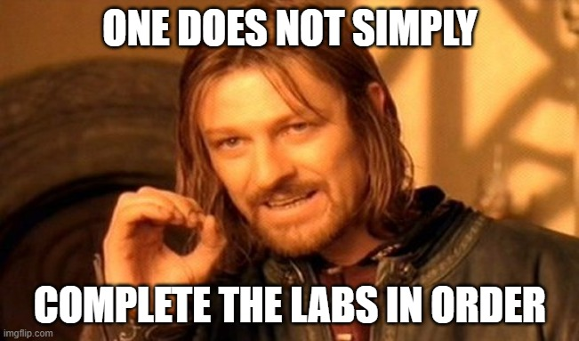

.. title:: Nutanix SE POC Guide

.. toctree::
   :caption: Resources
   :name: _info
   :hidden:

   self
   whatsnew/whatsnew
   scenario/scenario
   staging/staging

.. toctree::
   :maxdepth: 2
   :caption: Planning & Deployment
   :name: _planning
   :hidden:

   prereqs/prereqs
   hpoc/hpoc
   foundation/foundation
   diyfoundation/diyfoundation

.. toctree::
   :maxdepth: 2
   :caption: Initial Configuration
   :name: _info
   :hidden:

   clusterconfig/clusterconfig
   pcconfig/pcconfig
   vmmanage/vmmanage

.. toctree::
   :maxdepth: 2
   :caption: Infrastructure Lifecycle
   :name: _info
   :hidden:

   lcm/lcm
   lcm/pc/pc
   lcm/pe/pe
   node_addremove/node_addremove

.. toctree::
   :maxdepth: 2
   :caption: Flow
   :name: _flow
   :hidden:

   flow/flowbasic/flowbasic
   flow/flowappsec/flowappsec
   calm/deploygraylog/deploygraylog

.. toctree::
   :maxdepth: 2
   :caption: Calm
   :name: _calm
   :hidden:

   calm/calmenable/calmenable
   calm/singlevmwin/singlevmwin
   calm/deploypocapp/deploypocapp

.. toctree::
   :maxdepth: 2
   :caption: Files
   :name: _files
   :hidden:

   files/files1/files1
   files/files2/files2
   files/files3/files3

.. toctree::
   :maxdepth: 2
   :caption: X-Ray
   :name: _xray
   :hidden:

   xray/xray
   xray/xray1/xray1
   xray/xray2/xray2
   xray/xray3/xray3

.. toctree::
   :maxdepth: 2
   :caption: Failure Scenarios
   :name: _failure
   :hidden:

   failure/failure
   failure/cvm/cvm
   failure/hdd/hdd
   failure/nic/nic
   failure/node/node
   failure/power/power
   failure/psu/psu

.. toctree::
   :maxdepth: 2
   :caption: Era
   :name: _Era
   :hidden:

   db/mssql_deploy/mssql_deploy
   db/era_mssql/era_mssql
   db/basic_clone_ui/basic_clone_ui
   db/basic_clone_api/basic_clone_api
   db/mssql_restore/mssql_restore
   db/advanced_aag/advanced_aag
   db/multi_clusterTBD/multi_clusterTBD
   db/patch_sql/patch_sql

.. .. toctree::
..    :maxdepth: 2
..    :caption: Prism Ops
..    :name: _prismops
..    :hidden:
..
..    prismops/xfit
..    prismops/xplay

.. .. toctree::
..    :maxdepth: 2
..    :caption: Objects
..    :name: _Objects
..    :hidden:
..
..    objects/objects

.. toctree::
   :maxdepth: 2
   :caption: Appendix
   :name: _Appendix
   :hidden:

   appendix/appendix
   appendix/windows_scratch/windows_scratch

===============================
SE POC Guide Introduction (AHV)
===============================

.. raw:: html

  <strong>Before proceeding with any planning or exercises, review the *What's New* section.</strong>

What Is This?
+++++++++++++

The purpose of this guide is to provide detailed guidance to Nutanix or partner SEs on the delivery of a Proof of Concept either on-premises or using a Hosted POC cluster. It includes planning considerations, talking points, and step-by-step instructions for cluster deployment, configuration, and operation. **It is NOT the only way to deliver a Nutanix POC**. It simply serves as guidance for you to learn what good looks like, and provides a foundation upon which to build and modify in your own POCs.

This guide can also be used for users to obtain **Level 200 - Basic POC Validation** by completing exercises and performing a validation delivery to Portfolio Specialists, Solution Architects, Enablement, and/or SE Managers. See :ref:`scenario` for additional details.

Every successful POC has a well-defined test plan. While this guide will walk you through common uses and scenarios for Nutanix products, many POCs will also include workload or application specific requirements. When working with the customer to add these additional items to your test plan, keep in mind that: **Test items should identify success criteria (faster, simpler, provides new and required functionality, etc.) which are ideally measurable (less time to complete, less steps to configure), but may also be verification that a feature functions as expected (true/false).**

How Do I Use This Guide?
++++++++++++++++++++++++

No two POCs are the same, and as such, much of this guide is meant to be used modularly.

If you are already familiar with basic Nutanix cluster deployment and operation or using this tool to validate your ability to deliver a basic POC for a specific Nutanix Portfolio Product, see :ref:`staging` for instruction on how to automatically stage a HPOC cluster in order to skip directly to product exercises.

If you are onboarding, you will be staging your cluster manually to become more familiar with basic Nutanix operations and benefits:

   - To begin, review the **Planning & Deployment** section prior to your POC.
   - The **Initial Configuration** section covers exercises that are common to all AHV POCs, and should be completed in order. The notable exception is you could optionally complete **Lifecycle Infrastructure** and/or **X-Ray** exercises, such as AOS upgrades, *before* completing any of the **Basic VM Management** exercises.
   - Following that, additional modules can be completed in almost any order. If applicable, specific prerequisites will be noted at the beginning of each module. *This can be an important consideration based on your test plan. Depending on your test plan, it may be of far greater value/impact to show cluster lifecycle operations and failures on a cluster running multiple workloads, versus a freshly installed/empty cluster.*
   - Each module provides an approximate **Duration** to complete. Take these into account when planning time to spend in front of the customer working through test cases.

When Should I Do A POC?
+++++++++++++++++++++++

SEs have many tools at their disposal to prove the viability of Nutanix solutions, including customer case studies, reference architectures and best practice guides, Bootcamps, Test Drive, and POCs.

For many scenarios, providing a prospect hands on access through Test Drive or a Bootcamp may be enough to demonstrate the capabilities and value of our products.

POCs should generally be reserved for the following situations:

- Competitive situations, especially against VSAN/VxRail
- Project or opportunity with an approved, known budget
- You can answer *Why Now?* - The customer has a compelling reason to buy but has additional considerations or concerns before making a platform choice
- Trying to unseat an incumbent

How Do I Get Support?
+++++++++++++++++++++

If you're experiencing product issues during a POC, you can engage Nutanix Support directly by creating a case at https://portal.nutanix.com or calling 1-855-NUTANIX, Option 3. The full list of international support phone numbers can be found `here <https://www.nutanix.com/support-services/product-support/support-phone-numbers>`_.

For non-blocking issues, you can also try to engage Support in `#sre <slack://channel?team=T0252CLM8&id=C07SH5139>`_  or product specific channels (e.g. #calm, #era, #flow, etc.) in Slack.

Appendix
++++++++

It is highly recommended to read through the Appendix before you begin any POC, to understand what guidance is available for each portion of the workshop. While not applicable in every situation, consider these "good to know" before you begin your POC. For quick reference, that section is located here: :ref:`appendix`.

Feedback
++++++++

We already have multiple additions planned for this guide, including more advanced Calm exercises, Era, X-Play, and Leap. If you have additional feedback, questions, or ideas, please send them to te-amer@nutanix.com.
