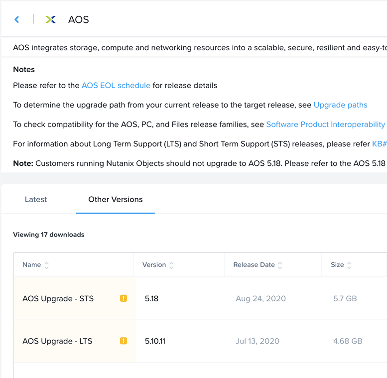

.. _prereqs:

--------------
Prerequisites
--------------

In order for an easy POC experience using this guide, it is important to ensure the environment you are testing has met all of the prerequisites. While the guide is applicable to both on-premises and Hosted POC (HPOC) environments, the prerequisites differ slightly.

Choosing Between HPOC and Physical
+++++++++++++++++++++++++++++++++++

The first determination to make is whether to use a Hosted POC cluster or an on-premises Nutanix cluster. The following considerations should be taken into account when making this decision:

- **Customer Impression and Effectiveness of Influencing Buying Decisions** - If a customer is less likely to be swayed by a HPOC or has reservations as to the real-world applicability of an HPOC to their environment an on-site POC may be considered. Phrases to listen for *“Of course it will work in your datacenter”, “How is this different from a demo?”, “Your environment is all pre-configured, correct?”*, etc.
- **Network and Data** - Does the customer need to integrate with any applications on their network or use their own data sets as part of the POC? If so, choose an on-premises POC.
- **Installation and Integration** - Is the installation process part of the POC test plan? If so, an on-premises POC is likely required (although there are ways to demonstrate Foundation within the HPOC).
- **Lead Time** - What is the timeline for beginning the POC? Typically you can secure a HPOC cluster 7 days out from the current date. Sourcing on-premises gear can vary significantly, depending on whether or not there is available gear already in your territory. Begin by asking in your regional Slack channel(s) about available POC blocks and their specs.
- **POC Length** - A HPOC cluster can be reserved for up to 14 days if it is associated with a POC record in Salesforce. On-premises POCs should last for no more than 45 days (although blocks can remain on-site longer if new use cases are identified and a new Salesforce POC record is created).
- **Your Availability** - Juggling many customers requests at once is difficult, and with physical POCs the level of involvement is higher. Outsourcing the success of a POC to the partner is usually not ideal.

HPOC Prerequisites
+++++++++++++++++++

Prerequisites for a Nutanix Hosted POC environment are simple, as you will have a predictable network topology and use a pre-created Domain Controller image.

You'll need the following:

- **Salesforce POC Record** - You'll need an active POC record in Salesforce in order to create a HPOC reservation > 48 hours. See `SE Wiki - Salesforce POC Process <https://confluence.eng.nutanix.com:8443/pages/viewpage.action?pageId=53219016>`_ for complete instruction on how to create a POC record.

- **An HPOC reservation**

   .. note::

      See :ref:`hpoc` for further instruction
- **Disk images**

   - `AutoAD <http://10.42.194.11/workshop_staging/AutoAD.qcow2>`_ (~10GB)
   - `CentOS <http://10.42.194.11/workshop_staging/CentOS7.qcow2>`_ (~1.5GB)
   - `Windows Server 2016 <http://10.42.194.11/workshop_staging/Windows2016.qcow2>`_ (~20GB)

   .. note:: The disk images do not need to be downloaded in advance of the POC, as they can be uploaded directly to the cluster using the links above.

On-premises Prerequisites
++++++++++++++++++++++++++

Prerequisites for an on-premises POC are more involved, as we need to ensure the provided networks and Active Directory are suitable. Establishing who will provide components such as network cables early on is critical, as is reviewing the network installation details sheet prior to arriving on-site for the install.

You'll need to verify the following with the customer:

- **Rackspace**

   - 1-2 rack unit (RU) per block, depending on the form factor of the block(s) being utilized.

- **Power**

   - 1-2 power connections per block, 2 required for full redundancy.  This can either be a C-13 to C-14 cable, or a C-13 to NEMA 5-15P and is dependent on the type of Power Distribution Unit (PDU) the customer is intending to use.
   - Sufficient power capacity available.  Ex. NX-3060-G7 has a typical power usage of 1700 Watts.
   - 200-240V power is required to run a 2U4N block from a single power supply

- **1x VLAN**

   - A single network can be used for your CVM/AHV network, as well as user VMs.
   - Recommended to be /24 or larger subnet, with no DHCP configured.
   - This network should be routable to/from the customer network and to the Internet.

- **(Optional) 1x XRay VLAN**
   - If using X-Ray for load generation or additional testing :ref:`xray`, you will require an additional network.
   - If DHCP is enabled, you'll want a /20 or larger subnet to ensure you have an adequate number of IPs for testing.
   - Ideally, request a network with no DHCP, allowing X-Ray to leverage `Link-local <https://en.wikipedia.org/wiki/Link-local_address>`_ or "Zero Configuration" networking, where the VMs communicate via self-assigned IPv4 addresses.

- **Network**

   - Network switch ports availability per node - (1+) 10 Gb connections (SFP+ or BASE-T), 2 required for full redundancy.  (1) 100/1000 Mb for lights out management (IPMI, ILO, iDRAC).
   - Network cables available per node, ensuring the proper lengths to not only traverse the distance between the node(s) and the network switch(es), but to confirm you aren't exceeding the cable or transceiver specification you are using.  For customers with SFP+ network switches, you may either use TwinAx or fiber cables with SFP+ transceivers on each end. (1+) 10 Gb connections (SFP+ or BASE-T), 2 required for full redundancy.  (1) 100/1000 Mb for lights out management (IPMI, ILO, iDRAC).  Verify with the customer/partner who will be providing the network cables. Nutanix can supply generic TwinAx cables but these will not work will all switch brands (Cisco, HPE, etc.).
   - Network switch configuration - Ensure all network switch ports are properly configured, including VLAN tagging, and that both the ports to be used and VLANs are already created and identified.  Typical installs utilize a single VLAN for CVM, Hypervisor, and user VMs.  However, this should be discussed and agreed upon with the customer prior to install.
   - `Pre-Install Survey <https://docs.google.com/spreadsheets/d/15r8Q1kCIJY4ErwL1CaHHwv4Q7gmCbLOz5IaR51t9se0/edit#gid=8195649>`_ completed *and reviewed* prior to on-site arrival. This spreadsheet outlines required IPs and VLANs for a deployment.

- **Software**

   - A downloaded version of AOS from https://portal.nutanix.com - Do **NOT** use the very latest version of AOS/AHV as you will be unable to show 1-Click upgrades as part of your POC.
   - To download an older or specific version you can navigate to the Downloads section of http://portal.nutanix.com select AOS or AHV, then select the Other Versions tab and the corresponding version of software that you want to use.
**NoIndent - 1310x1280 Image Resolution**
.. figure:: images/0.png
**SingleTab - 1310x1280 Image Resolution**
  .. figure:: images/0.png
**DoubleTab - 1310x1280 Image Resolution**
    .. figure:: images/0.png
**NoIndent - 1100x1075 Image Resolution**

**SingleTab - 1100x1075 Image Resolution**
  .. figure:: images/1.png
**DoubleTab - 1100x1075 Image Resolution**
    .. figure:: images/1.png
**NoIndent - 777x759 Image Resolution**

**SingleTab - 777x759 Image Resolution**
  .. figure:: images/2.png
**DoubleTab - 777x759 Image Resolution**
    .. figure:: images/2.png

- **4+ Nutanix nodes**

   - See `SE Wiki - Salesforce POC Process <https://confluence.eng.nutanix.com:8443/pages/viewpage.action?pageId=53219016>`_ for complete instruction on how to obtain physical POC hardware.

- **SE Installation Hardware** - Performing an on-premises Foundation requires, at a minimum, network connectivity between your Foundation app/VM and the block. The following are recommended parts of every SE's install "kit":

   - **16+ Port Flat Switch** - Flat/unmanaged switches avoid any potential configuration issues (disabled IPv6, etc.) that could negatively impact Foundation. This hardware can be requested directly from Nutanix IT.
   - **Ethernet Cables** - 2x cables per node being imaged, PLUS a single, long cable for connecting your laptop to the switch. This hardware can be requested directly from Nutanix IT.
   - **Compact Power Strip** - To plug in your laptop and your flat switch. *No one wants their laptop going to sleep mid-Foundation!*
   - **PDU Power Plug Adapter** - `Allowing you to connect your compact power strip to the rack PDU, which likely will not have standard outlets. <https://www.sfcable.com/nema-5-15r-to-c14-power-plug-adapter.html>`_ *Country specific*.
   - **(Optional) SFP to 1000Base-T Adapter** - `These <https://www.amazon.com/Cable-Matters-1000BASE-T-Transceiver-Supermicro/dp/B07TXRYJGF/ref=sr_1_3?dchild=1&keywords=sfp+ethernet+adapter&qid=1594907341&sr=8-3>`_ are only required when using Foundation on a node type without built-in Base-T/RJ45 NICs.

- **Active Directory** - You'll need to provide AD using one of these approaches:

   - **(Recommended)** Use the pre-created **AutoAD** disk image
   - If a customer requires integration with their own AD, you'll need:

      - Verify the minimum AD Forest Level is Windows Server 2008 R2 or newer
      - A Domain Admin account for Prism Element/Prism Central integration
      - 4x Security Groups, each with 1 or more users, that can map to the following roles:
         - Admin
         - Developer
         - Operator
         - Consumer

- **Disk Images**

   - `(Optional) AutoAD <https://get-ahv-images.s3.amazonaws.com/AutoAD.qcow2>`_ (~10GB)
   - `CentOS <https://get-ahv-images.s3.amazonaws.com/CentOS7.qcow2>`_ (~1.5GB)
   - `Windows Server 2016 <https://get-ahv-images.s3.amazonaws.com/Windows2016.qcow2>`_ (~20GB)

   .. note::

   The disk images can be downloaded directly onto the cluster using the provided Amazon S3 links during the POC. However, if you know the customer environment has poor bandwidth or no Internet connectivity, the images can also be downloaded separately and uploaded to the cluster locally via Prism.

   .. note::

   Future versions of this guide will provide instruction on creating your own CentOS and Windows Server 2016 images if the customer is uncomfortable using the existing disk images for security purposes.

.. _ntnxlab:

NTNXLAB.local Details
+++++++++++++++++++++

The NTNXLAB.local domain provided by the **AutoAD** VM is pre-populated with the following Security Groups and User Accounts:

.. list-table::
   :widths: 25 35 40
   :header-rows: 1

   * - Security Group
     - Username(s)
     - Password
   * - Administrators
     - Administrator
     - nutanix/4u
   * - SSP Admins
     - adminuser01-adminuser25
     - nutanix/4u
   * - SSP Developers
     - devuser01-devuser25
     - nutanix/4u
   * - SSP Consumers
     - consumer01-consumer25
     - nutanix/4u
   * - SSP Operators
     - operator01-operator25
     - nutanix/4u
   * - SSP Custom
     - custom01-custom25
     - nutanix/4u
   * - Bootcamp Users
     - user01-user25
     - nutanix/4u
